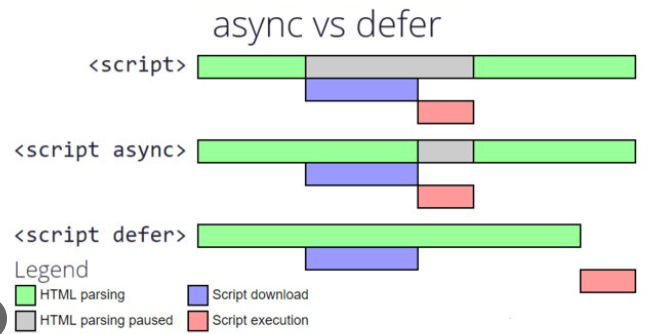

# _Chapter 01 - Inception_

## Q:1 What is `Emmet`?

A: `Emmet` is the essential development toolkit for web-developers. It allows you to `type shortcuts` that helps you quickly create repetitive structures like lists, tables, or ordered elements with minimal typing. It is more like a shorthand that translates to multiple lines of HTML or a CSS attribute.
For example,

- `p\*10` would generate 10 p elements.
- `ol>li` would create an li inside the ol element.
- `div+p` would create a div element and a p element on the same level.
- `div+p>span` would result in a div and a p element on the same level with a span element as a child of p selector
- `(main>div)+div>ul>li\*5`

```javascript
        <main>
            <div></div>
        </main>
        <div>
            <ul>
                <li></li>
                <li></li>
                <li></li>
                <li></li>
                <li></li>
            </ul>
        </div>
```

- `p{This is a paragraph}` would create a p element with content "This is a paragraph".
- `p#news-section` to create a p element with the ID of news-section
- `p.news-espanol` p element with the class of news-espanol
- `button[type=submit]` create this button element: <button type="submit"></button>.
- `script:src` To link JavaScript

<hr>

## Q:2 Difference between a `Library and Framework`?

A: A `library` is a collection of pre-written functions or modules that developers can use in their code, allowing them to perform specific tasks without starting from scratch.On the other hand, a `framework` is a pre-built architecture that dictates the overall structure and flow of an application. Developers use functions from a library by calling them in their code, while they build their code within the structure and guidelines provided by a framework. 

In the case of a library, developers control the flow of the code, whereas in a framework, the control flow is inverted. ReactJS is an example of a library, and ExpressJS is an example of a framework.

React is a library for building user interfaces, while Next.js is a framework built on top of React that provides additional features and conventions for building React applications, such as routing, server-side rendering, and API handling.

<hr>

## Q:3 What is `CDN`? Why do we use it?

A: A `content delivery network (CDN)` is a network refers to a geographically distributed group of servers that work together to provide fast delivery of Internet content web content, like images, CSS and scripts, to users based on their location. CDNs enhance web performance by reducing latency, ensuring faster content delivery, and improving overall user experience.
The main use of a CDN is to deliver content through a network of servers in a secure and efficient way.

<hr>

## Q:4 Why is `React known as React`?

A: `React` is named React because of its ability to `react to changes in data`.
React is called React because it was designed to be a declarative, efficient, and flexible JavaScript library for building user interfaces.
The name `React` was chosen because the library was designed to allow developers to "react" to changes in state and data within an application, and to update the user interface in a declarative and efficient manner and rendering the components when the state changes.
`React` is a `JavaScript-based UI development library`. `Facebook` and an `open-source developer community` run it.

<hr>


## Q:5 What is `crossorigin` in script tag`?

A: When you include a script (JavaScript file) in a webpage from a different website, the browser may treat it differently to ensure security. The crossorigin attribute in the script tag is like a set of instructions telling the browser how to handle this external script.

- If you use `crossorigin="anonymous"`, it means the script doesn't need any special permission (like login credentials) to be loaded.
- If you use `crossorigin="use-credentials"`, it means the script might need some special permission (like login credentials).

### _Syntax_

```sh
<script crossorigin="anonymous|use-credentials">
```

<hr>

## Q:6 What is difference between `React and ReactDOM`?

A: `React` is a JavaScript library for building User Interfaces whereas `ReactDOM` is also JavaScript library that allows `React to interact with the DOM`.

The react package contains `React.createElement()`, `React.Component`, `React.Children`, and other helpers related to elements and component classes. You can think of these as the isomorphic or universal helpers that you need to build components. The react-dom package contains `ReactDOM.render()`, and in react-dom/server we have server-side rendering support with `ReactDOMServer.renderToString()` and `ReactDOMServer.renderToStaticMarkup()`.

<hr>

## Q:7 What is difference between `react.development.js` and `react.production.js` files via `CDN`?

A: `Development` is the stage of an application before it's made public while `production` is the term used for the same application when it's made `public`.
`Development build` is several times (maybe 3-5x) `slower` than the `production build`.


<hr>

## Q:8 What is `async and defer`?

A: `Async` - The async attribute is a `boolean attribute`. The script is downloaded in `parallel(in the background)` to parsing the HTML page, and `executed as soon` as it is available (do not block HTML DOM construction during downloading process) and don’t wait for anything.

### _Syntax_

```sh
<script src="demo_async.js" async></script>
```

`Defer` - The defer attribute is a `boolean attribute`. The script is downloaded in `parallel(in the background)` to parsing the HTML page, and `executed after the HTML page` has finished parsing(when browser finished DOM construction). The `defer attribute` tells the browser `not to wait for the script`. Instead, the browser will continue to process the HTML, build DOM.

### _Syntax_

```sh
<script src="demo_defer.js" defer></script>
```




Unless you're supporting ancient legacy systems, always add `type="module"` to all your script tags:

```sh
<script type="module" src="main.js"></script> and place the tag inside <head>
```

```sh
 <script defer nomodule> can be used as a legacy fallback.
```

As the name suggests, it allows you to import `modules`, which makes it easier to organize your code.
Enable `strict mode` by default. This makes your code run faster, and reports more runtime errors instead of silently ignoring them.
Execute your code only after the DOM has `initialized`, which makes DOM manipulation easier. 


<hr>